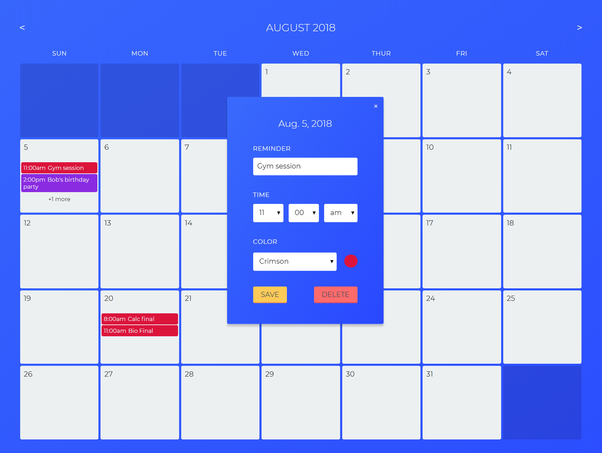

# React/Redux Developer Task

> React + Redux Calendar App

The is my attempt at creating a calendar app with reminders. The goal of the test is to complete the task in 90 minutes. However, my goal was to simply build a fully funtional calendar app to practice with nested components.

For a full list of task features and requirements, visit [here](https://developerjobsboard.co.uk/2018/07/28/an-example-senior-react-redux-developer-task/).


## Installation

Install dependencies:

```
npm install
```

## Usage example

Hover over a date to access the add reminder button.


Clicking the add button opens the reminder form modal.


Similarly, clicking an existing reminder opens the form modal with the input fields populated with the data of the selected reminder. A delete button is made available on the forms of existing reminders.



If a date contains more than two reminders, it will contain an overflow message displaying the number of additional reminders not displayed on the calendar.


Clicking on the overflow message opens a modal listing all reminders for the selected date. Select a reminder on the list to edit the contents.


